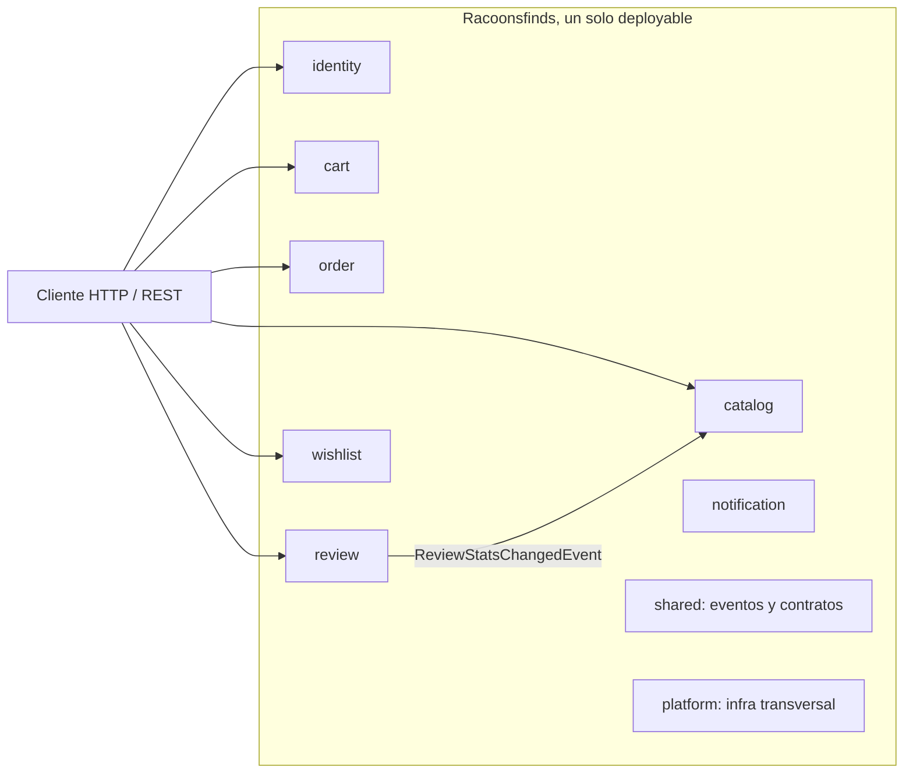

# Racoonsfinds Backend

Backend de un marketplace construido como monolito modular en Spring Boot 3.5 y Java 21, con limites entre dominios verificados por tests, comunicacion por eventos y un camino planificado hacia microservicios.

Este proyecto es un ejercicio que me propuse para aprender a disenar sistemas backend mientras estudio sistemas distribuidos. La mayor parte de las decisiones que vas a leer aqui salieron de tratar de aplicar, en algo concreto, ideas del libro Designing Data-Intensive Applications (DDIA): pensar en confiabilidad, escalabilidad y mantenibilidad; entender la diferencia entre datos del sistema de registro y datos derivados; y ver que la consistencia eventual es una herramienta, no un accidente. La idea no fue terminar un producto, sino tener un lugar donde probar esos conceptos y poder justificar cada decision.

---

## Resumen rapido

| | |
|---|---|
| Stack | Spring Boot 3.5.6, Java 21, Maven, PostgreSQL 16 |
| Arquitectura | Monolito modular (Spring Modulith 1.4), limites ejecutables |
| Comunicacion | Eventos de dominio y puertos/adaptadores (ports and adapters) |
| Persistencia | JPA/Hibernate, FKs cross-module desacopladas a IDs planos |
| Testing | JUnit 5, Testcontainers (Postgres real), tests de arquitectura |
| Observabilidad | Actuator, Micrometer, Prometheus y Grafana (provisioning as code) |
| Empaquetado | Docker multi-stage (layered jars, non-root), docker compose |
| Seguridad | JWT (access/refresh) sobre Spring Security |

---

## Por que esta hecho asi

Cuando empece a estudiar sistemas distribuidos me pasaba que entendia los conceptos en abstracto pero no sabia como se veian en codigo. Asi que en vez de saltar directo a microservicios, decidi empezar por un monolito modular y forzarme a respetar limites como si los modulos fueran servicios separados. La intencion era descubrir donde estan los acoplamientos reales antes de pagar el costo de la red, la consistencia eventual y el despliegue distribuido, que es justamente el tipo de complejidad que DDIA recomienda no introducir hasta necesitarla.

Las ideas que quise practicar:

- Hacer los limites entre dominios ejecutables: si un modulo toca las internals de otro o se forma un ciclo de dependencias, el build falla.
- Desacoplar por eventos lo que el dia de manana se podria extraer a un servicio, sin tener que reescribir la logica.
- Tratar la observabilidad, los contenedores y el testing contra dependencias reales como parte del diseno y no como un agregado al final.

Toda la planificacion, los diagramas, las explicaciones y los trade-offs estan desarrollados en [`docs/`](docs/).

---

## Arquitectura de un vistazo

Es un solo deployable dividido por dominio. Los modulos no se referencian por entidades JPA: las relaciones cross-module se guardan como IDs planos y se resuelven a traves de puertos, y los efectos secundarios que cruzan un limite viajan como eventos de dominio (asincronos, despues del commit).



Cuando se crea una resena, el modulo review publica un evento y el modulo catalog lo consume para denormalizar el rating promedio sobre el producto. Asi las lecturas del catalogo se quedan locales y no cruzan el limite hacia review. Esto es, en pequeno, la idea de dato derivado de DDIA: el rating es informacion que pertenece a review, pero catalog guarda una copia mantenida por evento para poder leer rapido.

Los diagramas C4/PlantUML reales se generan desde el codigo con `ModularityTests`, no se dibujan a mano. El detalle esta en [`docs/01-architecture.md`](docs/01-architecture.md).

---

## Como correrlo

### Levantar el stack completo

```bash
docker compose up
```

Levanta la app en el puerto 8080, PostgreSQL, Prometheus en el 9090 y Grafana en el 3000, con el dashboard cargado solo.

### Correr los tests

```bash
mvn test
```

Incluye la verificacion de arquitectura y los tests de integracion contra un Postgres real (Testcontainers). El detalle esta en [`docs/04-testing-strategy.md`](docs/04-testing-strategy.md).

---

## Documentacion (`docs/`)

La documentacion va desde la planificacion hasta los trade-offs. Cada parte es autocontenida.

| # | Documento | De que trata |
|---|-----------|--------------|
| 00 | [Vision y dominio](docs/00-overview.md) | Problema, alcance, objetivos y por que monolito modular |
| 01 | [Arquitectura](docs/01-architecture.md) | Modulos, limites, diagramas C4, estructura de paquetes |
| 02 | [Eventos y desacoplamiento](docs/02-domain-events.md) | Ports and adapters, eventos de dominio, denormalizacion, consistencia eventual |
| 03 | [Datos y persistencia](docs/03-data-persistence.md) | JPA, Postgres, datos por modulo, desacople de FKs a IDs planos |
| 04 | [Estrategia de testing](docs/04-testing-strategy.md) | Tests de arquitectura, Testcontainers, tests de modulo en aislamiento |
| 05 | [Observabilidad](docs/05-observability.md) | Actuator, Micrometer, Prometheus, Grafana, metricas, provisioning |
| 06 | [Contenedores y dev local](docs/06-containers.md) | Dockerfile multi-stage, layered jars, compose, healthchecks |
| 07 | [Seguridad](docs/07-security.md) | JWT, Spring Security, manejo de secretos |
| 08 | [Roadmap a microservicios](docs/08-roadmap-microservices.md) | Fases, sagas, AWS/Terraform/ECS, arquitectura hibrida |
| 09 | [Decisiones y trade-offs](docs/09-decisions.md) | Bitacora de decisiones (estilo ADR) con su justificacion |
