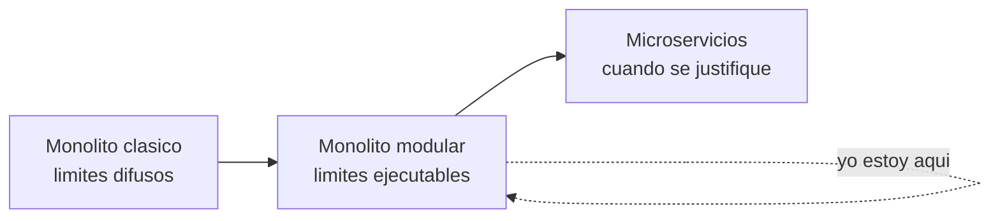

# 00 - Vision y dominio

Este documento explica que problema modela el sistema, hasta donde quise llegar y por que elegi empezar por un monolito modular en vez de microservicios.

## El contexto personal

Empece este proyecto como una forma de aterrizar lo que estoy estudiando de sistemas distribuidos. Leyendo Designing Data-Intensive Applications me quedaba claro el que (consistencia eventual, datos derivados, particionamiento, tolerancia a fallos) pero no el como se ve eso en una base de codigo real. Un marketplace me sirvio porque tiene varios dominios que interactuan (usuarios, catalogo, carrito, ordenes, resenas) y por lo tanto obliga a tomar decisiones sobre como se comunican esas partes sin que se conviertan en un nudo.

El objetivo entonces no es el producto. Es tener un terreno concreto para practicar diseno y poder explicar, decision por decision, por que algo esta hecho de una manera y no de otra.

## El dominio

Racoonsfinds es un marketplace. Los actores y capacidades principales:

- Compradores y vendedores, gestionados por el modulo de identidad y autenticacion.
- Un catalogo de productos.
- Un carrito de compras.
- Ordenes de compra.
- Resenas sobre productos.
- Listas de deseos (wishlist).
- Notificaciones.

## Alcance y no-alcance

Lo que el proyecto si cubre: la mecanica de estos dominios, sus limites, como se comunican y como se observa y despliega el sistema.

Lo que deliberadamente queda fuera o simplificado: pasarelas de pago reales, logistica de envios y catalogos a escala de produccion. No son el punto del ejercicio; donde aparecen (por ejemplo el nudo orden/pago/stock) los trato como un caso de estudio de diseno, no como una integracion real.

## Por que monolito modular y no microservicios

Esta es la decision de fondo de todo el proyecto. La tentacion de un proyecto de portfolio es arrancar con microservicios porque suena avanzado, pero DDIA insiste en una idea que me parecio mas honesta: la complejidad distribuida (latencia de red, fallos parciales, consistencia eventual, despliegue coordinado) hay que pagarla solo cuando un problema real lo justifica.

Un monolito modular me da casi todos los beneficios de tener limites claros (cada dominio aislado, con su propia API, listo para extraerse) sin pagar todavia ese costo. Y lo mas importante para aprender: me deja descubrir donde estan los acoplamientos reales entre dominios mientras todo sigue corriendo en un solo proceso, que es mucho mas barato de corregir que entre servicios ya desplegados.

La regla que me puse: un modulo se extrae a un servicio cuando hay una razon concreta para escalarlo o desplegarlo por separado, no antes. Como ya esta aislado por puertos y eventos, ese dia el cambio es de transporte, no de diseno.

## Mapa de modulos

| Modulo | Responsabilidad |
|--------|-----------------|
| identity | Usuarios, autenticacion JWT, directorio de usuarios hacia otros modulos |
| catalog | Productos, stock y el rating denormalizado |
| cart | Carrito de compras |
| order | Ordenes de compra |
| review | Resenas y su agregacion en estadisticas |
| wishlist | Listas de deseos |
| notification | Envio de notificaciones |
| platform | Infra transversal (por ejemplo almacenamiento en S3) |
| shared | Contratos neutros y eventos de dominio compartidos |
| config | Configuracion transversal (seguridad, etc.) |

## Principios rectores

- Los limites entre dominios son ejecutables, no documentacion que se desactualiza.
- Lo que cruza un limite lo hace por un puerto o un evento, nunca por una llamada directa a las internals de otro modulo.
- Se prueba contra dependencias reales (Postgres), no contra mocks de la base.
- La observabilidad y el empaquetado se piensan desde el principio.

## Para seguir

- Como se materializan estos limites en codigo: [01-architecture.md](01-architecture.md)
- Por que cada decision: [09-decisions.md](09-decisions.md)
