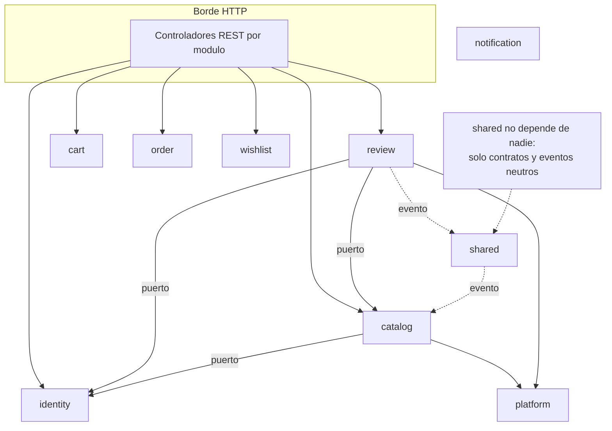

# 01 - Arquitectura

Aqui explico como esta estructurado el sistema por dentro y, sobre todo, como hago para que los limites entre dominios se cumplan de verdad y no solo en un diagrama.

## Monolito modular en concreto

Un monolito modular es un solo deployable dividido internamente en modulos por dominio, donde cada modulo expone una API publica chica y mantiene el resto como interno. La parte interesante no es la division (cualquiera separa en paquetes) sino que la division se haga cumplir. Si nada impide que un modulo importe una clase interna de otro, con el tiempo los limites se erosionan y termino con un monolito clasico disfrazado.

Para que eso no pase uso Spring Modulith.

## Spring Modulith: limites ejecutables

Spring Modulith infiere los modulos a partir de la estructura de paquetes y permite verificar reglas sobre ellos en tiempo de test. La regla principal: un modulo solo puede usar la API publica de otro, nunca sus internals, y no puede haber ciclos de dependencia.

Esa verificacion vive en un test:

```java
static final ApplicationModules modules =
        ApplicationModules.of(RacoonsfindsBackendApplication.class);

@Test
void verifiesModularStructure() {
    modules.verify();
}
```

Si alguien (yo mismo, en seis meses) hace que catalog importe una clase de servicio interna de review, `modules.verify()` rompe el build. El limite deja de ser una intencion y pasa a ser una propiedad verificada, igual que un test de unidad protege un comportamiento.

Esto conecta con la idea de mantenibilidad de DDIA: el costo grande de un sistema no es escribirlo sino evitar que se degrade. Un limite que el compilador o el build hacen cumplir es mucho mas barato de mantener que uno que depende de que todos recuerden la convencion.

## Que expone cada modulo

Por defecto, en Spring Modulith el paquete raiz del modulo es su API publica y todo lo demas es interno. En este proyecto afino eso con `@NamedInterface`: marco subpaquetes concretos como parte de la API. Por ejemplo, el subpaquete `port` de catalog se expone asi:

```java
@org.springframework.modulith.NamedInterface("port")
package com.racoonsfinds.backend.catalog.port;
```

De esta forma otros modulos pueden depender de `catalog.port.ProductCatalogPort` (una interfaz) pero no de `catalog.service` ni de `catalog.repository`. La superficie de contacto entre modulos queda reducida a propos a interfaces y eventos.

## Estructura de paquetes

Cada modulo sigue la misma convencion interna:

```text
com.racoonsfinds.backend.<modulo>
    api          controladores REST
    service      logica de negocio
    domain       entidades del dominio
    repository   acceso a datos (JPA)
    port         interfaces hacia otros modulos (API publica)
    event        listeners de eventos de otros modulos
    dto, mapper  transporte y conversion
```

No todos los modulos tienen todos los subpaquetes; solo los que necesitan. Por ejemplo `catalog` tiene `event` porque consume eventos de review, y `review` no necesita exponer un `port` hacia afuera.

## Vista de modulos y dependencias



Dos roles especiales:

- shared no depende de ningun modulo de dominio. Contiene contratos neutros y los eventos de dominio. Que catalog y review compartan `ReviewStatsChangedEvent` sin que ninguno dependa del otro es posible porque el evento vive en shared.
- platform concentra infra transversal (por ejemplo el almacenamiento en S3) para que los modulos de dominio no hablen directamente con la nube.

## Diagramas generados desde el codigo

Un riesgo conocido de los diagramas de arquitectura es que se desactualizan apenas el codigo cambia. Para evitarlo, no los dibujo a mano: los genero desde el codigo con Modulith.

```java
@Test
void writesDocumentationSnippets() {
    new Documenter(modules)
            .writeModulesAsPlantUml()
            .writeIndividualModulesAsPlantUml()
            .writeModuleCanvases();
}
```

Esto escribe en `target/spring-modulith-docs` los diagramas C4/PlantUML de todos los modulos, uno por modulo, y un module canvas (una ficha por modulo con su API, sus dependencias y los eventos que publica y consume). Como sale del mismo modelo que verifica los limites, siempre refleja el estado real.

## Para seguir

- Como se comunican los modulos sin acoplarse: [02-domain-events.md](02-domain-events.md)
- Como se prueban estos limites: [04-testing-strategy.md](04-testing-strategy.md)
