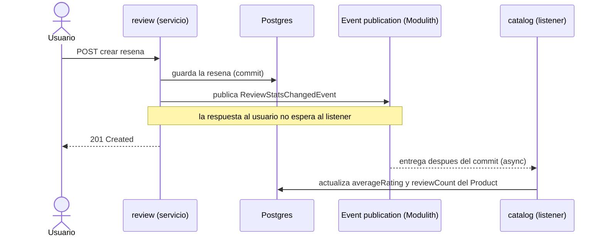

# 02 - Eventos de dominio y desacoplamiento

Este es el documento mas importante del proyecto, porque es donde practico la idea central que me llevo de DDIA: la comunicacion entre partes de un sistema se puede modelar como flujo de datos y eventos, no solo como llamadas a funciones. Aqui explico como se hablan los modulos sin acoplarse.

## El problema: acoplamiento entre dominios

La forma ingenua de que catalog muestre el rating de un producto seria que catalog llame al servicio de review y le pida las estadisticas, o peor, que haga un join entre las tablas de los dos. Las dos opciones acoplan catalog a review: a su esquema, a su disponibilidad, a su forma interna. El dia que quiera separar review, ese acoplamiento es exactamente lo que me lo impide.

Use dos herramientas para evitarlo: puertos y eventos.

## Puertos y adaptadores

Cuando un modulo necesita un dato de otro de forma sincrona (por ejemplo, review necesita validar que un producto existe), no llama a su servicio interno: llama a una interfaz, un puerto, que vive en la API del modulo dueno del dato.

```java
public interface ProductCatalogPort {
    ProductSnapshot findById(Long productId);
}
```

review depende de `ProductCatalogPort`, no de la implementacion. Hoy la implementacion es un adaptador local (`LocalProductCatalogAdapter`) que por debajo llama al servicio de catalog dentro del mismo proceso. El dia que catalog sea un servicio aparte, ese adaptador se reemplaza por uno HTTP y review no se entera. El puerto es la costura por donde se va a poder cortar.

Esto es la idea de ports and adapters (arquitectura hexagonal): el dominio define que necesita (el puerto) y la infraestructura decide como se cumple (el adaptador).

## Eventos de dominio

Cuando lo que cruza el limite no es una pregunta sino un hecho que ya paso (se creo una resena), uso un evento en vez de una llamada. El modulo que produce el hecho publica un evento y se olvida; el modulo interesado reacciona por su cuenta.

El evento vive en shared para que sea un contrato neutro y ningun modulo dependa del otro:

```java
public record ReviewStatsChangedEvent(
        Long productId,
        double averageRating,
        long reviewCount) {}
```

Notar que review no conoce a catalog y catalog no conoce a review. Los dos conocen el evento, que esta en un lugar neutro. Esa es la diferencia entre acoplamiento directo y acoplamiento por contrato.

## Caso de estudio: denormalizar el rating

El flujo completo cuando alguien crea una resena:



Del lado de catalog, el listener consume el evento y denormaliza las estadisticas sobre la entidad Product:

```java
@ApplicationModuleListener
void on(ReviewStatsChangedEvent event) {
    // busca el Product por id plano y le escribe
    // averageRating y reviewCount
}
```

`@ApplicationModuleListener` combina tres cosas que importan: el listener corre de forma asincrona, dentro de su propia transaccion, y solo despues de que la transaccion que publico el evento hizo commit.

## Por que asincrono y despues del commit

- Despues del commit: si la creacion de la resena hace rollback, el evento no se entrega. No quiero que catalog reaccione a un hecho que al final no ocurrio.
- Asincrono: la escritura de la resena no se bloquea esperando a que catalog actualice su tabla. El usuario recibe su respuesta y la denormalizacion ocurre un instante despues.

Esto introduce consistencia eventual: hay una ventana, normalmente de milisegundos, en la que la resena ya existe pero el rating del producto todavia no refleja el cambio. En DDIA esto se discute como el costo natural de tener datos derivados que se mantienen de forma asincrona. Para este caso es perfectamente aceptable: que el rating de un producto tarde un instante en actualizarse no rompe nada. A cambio, las lecturas del catalogo son locales y no dependen de la disponibilidad de review.

El rating sobre Product es, en lenguaje de DDIA, un dato derivado: el sistema de registro de las resenas es review; catalog mantiene una vista materializada (una copia ya agregada) optimizada para leer.

## Por que esto importa para el futuro

Hoy el evento viaja in-process, dentro de la misma JVM, gestionado por Modulith. Pero el modelo es exactamente el mismo que el de un sistema con un broker de mensajes: alguien publica, alguien consume, de forma desacoplada. El dia que review se extraiga a un servicio, el evento pasa a viajar por RabbitMQ o Kafka y la logica de negocio no cambia. Practicar el patron in-process primero me deja entender el modelo sin la complejidad operacional del broker todavia.

## Artefactos en el repo

- `shared/event/ReviewStatsChangedEvent`
- `catalog/event/ReviewStatsListener`
- `catalog/port/ProductCatalogPort`, `identity/port/UserDirectoryPort`

## Para seguir

- Como se prueba este flujo end-to-end contra Postgres real: [04-testing-strategy.md](04-testing-strategy.md)
- Como evoluciona a mensajeria y sagas: [08-roadmap-microservices.md](08-roadmap-microservices.md)
