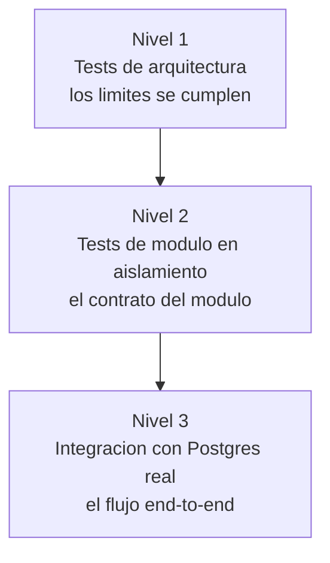

# 04 - Estrategia de testing

La idea que persigo aqui es que la arquitectura sea verificable y no solo aspiracional. Un limite que nadie comprueba se rompe; un dato derivado que nadie prueba puede quedar desincronizado sin que me entere. Por eso el testing esta organizado en tres niveles, cada uno protegiendo una propiedad distinta del diseno.



## Nivel 1: tests de arquitectura

El test mas barato y el que mas degradacion previene. `modules.verify()` recorre el modelo de modulos y falla si encuentra una violacion de limite o un ciclo de dependencias.

```java
@Test
void verifiesModularStructure() {
    modules.verify();
}
```

No prueba comportamiento, prueba estructura. Es la red que evita que, con el tiempo, los modulos se enreden entre si. Mas detalle en [01-architecture.md](01-architecture.md).

## Nivel 2: tests de modulo en aislamiento

Con `@ApplicationModuleTest` levanto un solo modulo, no toda la aplicacion. Los demas modulos no estan; sus puertos se sustituyen por mocks. Esto me obliga a que el modulo bajo prueba realmente dependa solo de sus puertos, porque si dependiera de algo mas, el test ni siquiera arrancaria.

El caso concreto: verificar que crear una resena publica el evento correcto. Uso `PublishedEvents`, una utilidad de Modulith que captura los eventos emitidos durante el test.

```java
@ApplicationModuleTest
class ReviewEventPublicationTest extends PostgresTestContainer {

    @Autowired ReviewService reviewService;
    @MockitoBean ProductCatalogPort productCatalogPort;
    @MockitoBean UserDirectoryPort userDirectoryPort;

    @Test
    void publishesEventWhenReviewIsCreated(PublishedEvents events) {
        // arrange: el puerto de catalog devuelve un producto mockeado
        reviewService.createReview(new ReviewRequestDto(42L, 5, "Excelente"));

        var published = events.ofType(ReviewStatsChangedEvent.class);
        assertThat(published).hasSize(1);
        // y se verifica productId, reviewCount y averageRating
    }
}
```

Lo que prueba: el contrato de salida de review. Crear una resena debe producir exactamente un `ReviewStatsChangedEvent` con los datos correctos. No me importa quien lo consume; eso es asunto de otro modulo.

## Nivel 3: integracion contra Postgres real

Aqui pruebo el flujo completo, incluido el listener asincrono, contra una base Postgres de verdad levantada con Testcontainers. Para el flujo dirigido por eventos uso la API Scenario de Modulith, que publica un evento dentro de una transaccion y espera el cambio de estado:

```java
@Test
void denormalizesReviewStatsOntoProduct(Scenario scenario) {
    Product saved = productRepository.save(/* un producto */);

    scenario.publish(new ReviewStatsChangedEvent(saved.getId(), 4.5, 3L))
            .andWaitForStateChange(() ->
                productRepository.findById(saved.getId()).orElseThrow().getReviewCount())
            .andVerify(count -> {
                Product reloaded = productRepository.findById(saved.getId()).orElseThrow();
                assertThat(reloaded.getReviewCount()).isEqualTo(3L);
                assertThat(reloaded.getAverageRating()).isEqualTo(4.5);
            });
}
```

Lo que prueba: que cuando el evento se publica, el listener de catalog efectivamente persiste las estadisticas sobre el Product. `andWaitForStateChange` espera a que el procesamiento asincrono termine, sin sleeps fragiles.

## Por que Testcontainers y no H2

La tentacion es probar contra H2, una base en memoria que arranca instantanea. El problema es que H2 simula SQL pero no es Postgres: difiere en tipos, en funciones de agregacion, en locking optimista, en el comportamiento de las transacciones. Si pruebo contra H2 y despliego contra Postgres, en el fondo estoy probando un sistema distinto al que corro. Testcontainers levanta un Postgres real dentro de Docker, identico al de produccion, asi que los tests atrapan bugs de dialecto y de migracion que un mock o H2 esconderian.

Para no pagar el arranque del contenedor en cada clase de test, uso un contenedor singleton: se levanta una vez por JVM y se reutiliza.

```java
public abstract class PostgresTestContainer {
    static final PostgreSQLContainer<?> POSTGRES = new PostgreSQLContainer<>("postgres:16");
    static { POSTGRES.start(); }

    @DynamicPropertySource
    static void datasourceProperties(DynamicPropertyRegistry registry) {
        registry.add("spring.datasource.url", POSTGRES::getJdbcUrl);
        registry.add("spring.datasource.username", POSTGRES::getUsername);
        registry.add("spring.datasource.password", POSTGRES::getPassword);
    }
}
```

## Estado y nota de entorno

A la fecha el conjunto pasa con 47 tests en verde, incluidos los dos de integracion descritos y la verificacion de arquitectura.

Una nota honesta sobre reproducibilidad: correr los tests de Testcontainers en mi maquina Windows local requirio un rodeo. La libreria cliente de Docker que trae Testcontainers (docker-java) negocia una version de API que los motores Docker modernos ya rechazan (su API minima es mas nueva). La solucion local fue apuntar Testcontainers a un motor Docker mas viejo via dind. En un runner Linux de CI (por ejemplo GitHub Actions) esto no hace falta: corre de forma nativa. Lo dejo documentado para que el proximo que clone el repo no se pierda en el mismo problema.

## Para seguir

- El diseno de eventos que estos tests protegen: [02-domain-events.md](02-domain-events.md)
- Los limites que verifica el nivel 1: [01-architecture.md](01-architecture.md)
