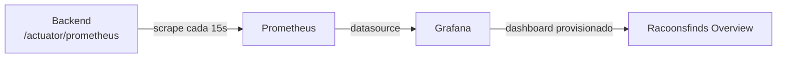

# 05 - Observabilidad

DDIA insiste mucho en que un sistema no termina cuando funciona, sino cuando se puede operar: saber si esta sano, por que se degrada, donde esta el cuello de botella. Por eso quise que la observabilidad fuera parte del diseno desde el principio y no algo que se agrega despues de un incidente. Y, sobre todo, que se levante con un comando y no haya que configurar nada a mano.

## Instrumentacion de la app

Uso Actuator y Micrometer. Micrometer es una fachada de metricas: el codigo registra metricas contra una API neutra y se exporta al formato que se quiera. Aqui se exporta en formato Prometheus, expuesto en `/actuator/prometheus`.

Con eso, gratis, ya tengo metricas tecnicas: uso de memoria y GC de la JVM, latencia y tasa de las requests HTTP (con histogramas de percentiles activados), y el estado del pool de conexiones HikariCP. Son justo las senales que DDIA menciona para razonar sobre carga y rendimiento: latencia de cola (p99, no promedios) y saturacion de recursos.

## El stack completo, reproducible

El valor no esta solo en exponer metricas sino en poder verlas sin fricciones. `docker compose up` levanta, ademas de la app y la base, Prometheus y Grafana ya conectados.

La pieza importante es el provisioning as code: ni el datasource ni el dashboard se configuran clickeando en la interfaz de Grafana. Estan versionados como archivos en el repo y Grafana los carga al arrancar. Asi cualquiera que levante el stack ve exactamente el mismo tablero, y el tablero esta en control de versiones como cualquier otro codigo.

- `monitoring/prometheus.yml` define el scrape job hacia el backend cada 15 segundos.
- `monitoring/grafana/provisioning/` define el datasource Prometheus y el dashboard.

## Metricas de negocio (siguiente paso)

Las metricas tecnicas vienen solas, pero las que de verdad cuentan una historia son las de negocio. El siguiente paso es instrumentar con Micrometer:

- un contador de compras creadas,
- un contador de fallos de pago,
- un temporizador (`@Timed`) sobre la subida de archivos a S3.

Estas metricas son las que permiten responder preguntas que importan (esta cayendo la tasa de compras, esta lento S3) y no solo si la JVM respira.

## Health checks

Tengo activadas las probes de liveness y readiness de Actuator. Un orquestador como ECS o Kubernetes las usa para dos cosas distintas: liveness le dice si el proceso esta vivo o hay que reiniciarlo; readiness le dice si esta listo para recibir trafico. Distinguirlas evita mandar requests a una instancia que todavia esta arrancando.

## Deuda conocida: endurecer Actuator

Hoy, por simplicidad de desarrollo, los endpoints de Actuator estan abiertos. En produccion eso no va: endpoints como env, beans o heapdump exponen detalle interno. El plan es limitar la exposicion a health, info y prometheus, y ademas mover Actuator a un puerto de management separado que no quede expuesto al exterior, o restringirlo a nivel de red en el balanceador. Queda registrado en [09-decisions.md](09-decisions.md).

## Que vigilaria en produccion

- Tasa de error y p99 de latencia HTTP.
- Saturacion del pool HikariCP (conexiones esperando).
- Memoria y GC de la JVM.
- Las metricas de negocio una vez instrumentadas.

Con alertas basicas sobre esos cuatro grupos ya se cubre la mayoria de los incidentes tipicos.

## Para seguir

- Como se levanta junto al resto del stack: [06-containers.md](06-containers.md)
- Como se traslada esto a AWS: [08-roadmap-microservices.md](08-roadmap-microservices.md)
