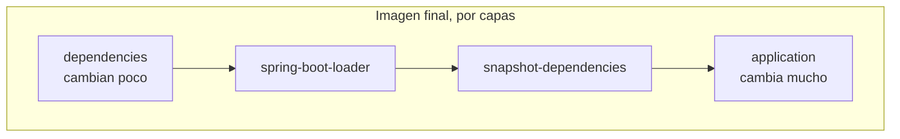

# 06 - Contenedores y entorno local

Aqui explico como se empaqueta y se levanta el sistema. Para un proyecto que apunta a desplegarse en la nube, la imagen y el entorno local no son un detalle: son la primera parte de la cadena de despliegue, y vale la pena que esten bien armadas.

## Dockerfile multi-stage

La imagen se construye en varias etapas. Una etapa compila con Maven y otra arma el runtime. Separar las etapas tiene dos beneficios: el runtime no carga con Maven ni con el codigo fuente, y se puede cachear cada parte por separado.

El truco mas util es cachear las dependencias aparte del codigo. Las dependencias cambian poco; el codigo cambia mucho. Si copio primero el archivo de dependencias y las descargo, y recien despues copio el codigo, un cambio de una linea no vuelve a bajar todo el arbol de dependencias.

## Layered jars: por que importa en Docker

Un jar de Spring Boot, por defecto, es un solo archivo. Si lo meto entero en una capa de Docker, cualquier cambio de codigo invalida esa capa completa y obliga a reconstruir y resubir cientos de megas de dependencias que no cambiaron.

Spring Boot permite extraer el jar en capas segun que tan seguido cambia cada cosa:

```dockerfile
RUN cp target/*.jar application.jar \
 && java -Djarmode=tools -jar application.jar extract --layers --destination extracted
```

Esto separa dependencias, el loader de Spring Boot, dependencias snapshot y, por ultimo, el codigo de la aplicacion. En el runtime copio esas capas en orden de menor a mayor frecuencia de cambio.



Resultado: un cambio de codigo solo recopia la ultima capa, la de la aplicacion. Docker reusa el resto de la cache. Esto es exactamente lo que acelera los despliegues repetidos.

## Runtime non-root

El proceso corre como un usuario dedicado sin privilegios, no como root. Es una buena practica de seguridad de contenedores: si algo se compromete, el blast radius es menor. Cuesta tres lineas en el Dockerfile y no tiene contras.

## Decision sobre la imagen base

El runtime usa `eclipse-temurin:21-jdk-jammy`. Una optimizacion comun seria pasar a una imagen JRE slim para reducir tamano, pero por ahora mantengo la JDK de forma consciente. Lo dejo anotado como trade-off abierto en [09-decisions.md](09-decisions.md): es una mejora de tamano disponible si se quiere, no un olvido.

## .dockerignore

Para que el contexto de build sea limpio y no se filtren cosas que no deben entrar a la imagen, excluyo `target/`, `.git/`, los apuntes en markdown, los archivos de entorno (`.env`) y la carpeta de infraestructura. Menos contexto significa builds mas rapidos y, mas importante, evitar hornear secretos en la imagen por accidente.

## docker compose y el race de arranque

El compose orquesta cuatro servicios: la app, Postgres, Prometheus y Grafana.

Un problema clasico aparecio aqui: la app arrancaba antes de que Postgres estuviera listo y moria con un error de dialecto, porque `depends_on` por si solo espera a que el contenedor de la base se cree, no a que la base este aceptando conexiones. La solucion es un healthcheck real sobre la base y que la app espere a esa condicion:

```yaml
db:
  healthcheck:
    test: ["CMD-SHELL", "pg_isready -U ${POSTGRES_USER} -d ${POSTGRES_DB}"]
    interval: 5s
    timeout: 5s
    retries: 5

backend:
  depends_on:
    db:
      condition: service_healthy
```

`pg_isready` comprueba que Postgres realmente acepta conexiones; recien ahi arranca el backend. Es una version chiquita de un problema muy real en sistemas distribuidos: no asumir que una dependencia esta lista solo porque existe.

## Configuracion por entorno

Toda la configuracion sensible o que cambia entre entornos (credenciales de Postgres, secreto JWT, claves de AWS) entra por variables de entorno, nunca horneada en la imagen. La misma imagen sirve para local y para la nube; lo unico que cambia es la configuracion que se le inyecta.

## Para seguir

- El stack de observabilidad que este compose levanta: [05-observability.md](05-observability.md)
- Como se manejan los secretos en local vs produccion: [07-security.md](07-security.md)
