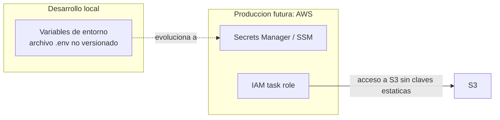

# 07 - Seguridad

Este documento cubre como se autentica y autoriza el sistema, y como manejo los secretos. No pretende ser seguridad de nivel banco; busca tener lo basico bien hecho y mostrar conciencia de los puntos donde un sistema se endurece antes de ir a produccion.

## Autenticacion con JWT

Uso JSON Web Tokens sobre Spring Security, con dos tipos de token:

- Un access token de vida corta, que viaja en cada request y autoriza el acceso.
- Un refresh token de vida mas larga, que permite obtener un nuevo access token sin volver a pedir credenciales.

La ventaja del esquema es que el access token es autocontenido: el servidor puede validarlo sin consultar la base en cada request, porque la firma garantiza que no fue alterado. Es una decision de diseno con su trade-off: a cambio de no consultar estado en cada request, revocar un token antes de que expire es mas dificil. Para este proyecto el balance es razonable.

## Fortaleza de la clave de firma

Los tokens se firman con HMAC-SHA. La clave debe tener al menos 256 bits. Esto no es un capricho: una clave corta hace la firma vulnerable a fuerza bruta, y la libreria directamente lanza una excepcion (`WeakKeyException`) si la clave no llega al minimo. Me tope con esto en la practica cuando el secreto de desarrollo era demasiado corto y la app no arrancaba. La leccion: la libreria me obligo a hacer lo correcto, que es como deberia ser.

## Autorizacion y resolucion del usuario

Spring Security protege los endpoints segun el rol o la autenticacion. Dentro de los servicios, el identificador del usuario autenticado se obtiene del contexto de seguridad, no de un parametro que mande el cliente. Esto evita que alguien pueda actuar en nombre de otro simplemente cambiando un id en la request.

## Superficie de Actuator

Como menciono en [05-observability.md](05-observability.md), los endpoints de Actuator hoy estan abiertos por comodidad de desarrollo. Es justo el tipo de cosa que hay que cerrar antes de produccion, porque endpoints como env o heapdump exponen detalle interno valioso para un atacante. El plan es dejar publicos solo health, info y prometheus, y aislar el resto por puerto o por red.

## Manejo de secretos

Hoy, en local, los secretos entran por variables de entorno desde un archivo `.env` que no se versiona ni entra a la imagen. Es suficiente para desarrollo, pero no es como deberia ser en produccion.

El plan para la nube:

- El secreto JWT, las credenciales de la base y las claves de terceros van a AWS Secrets Manager o SSM, y se inyectan en la definicion de la tarea de ECS como secrets, no como variables de entorno en texto plano.
- El acceso a S3 se hace via un IAM task role en vez de claves estaticas. Asi no hay credenciales de AWS guardadas en ningun lado: el rol se asocia a la tarea y AWS rota las credenciales por debajo.

La regla general que sigo: ningun secreto vive en el codigo, ni en la imagen, ni en el control de versiones.

## Para seguir

- Como se inyecta la configuracion por entorno en contenedores: [06-containers.md](06-containers.md)
- Donde viven los secretos en el deploy a AWS: [08-roadmap-microservices.md](08-roadmap-microservices.md)
