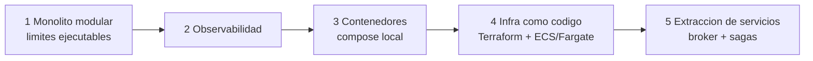
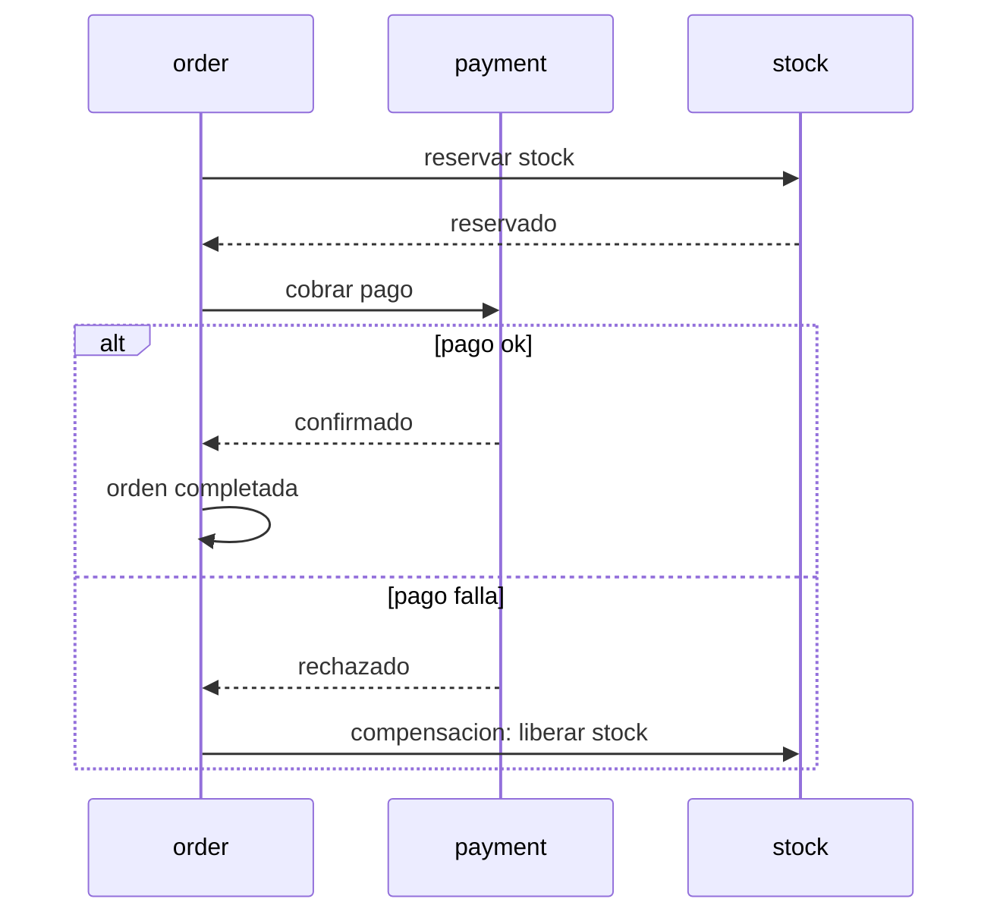

# 08 - Roadmap a microservicios

Este documento describe hacia donde podria evolucionar el sistema y, sobre todo, por que el diseno actual ya esta preparado para esa evolucion. La gracia del monolito modular es que el camino a microservicios no es una reescritura, sino una serie de pasos donde en cada uno el sistema sigue desplegable.

## Las fases

Las fases 1 a 3 ya estan hechas. Las fases 4 y 5 son el plan. Lo importante es que cada fase deja el sistema corriendo: no hay un momento de gran reescritura.

## Criterio para extraer un servicio

No extraigo un modulo por moda, sino cuando hay una razon concreta: que necesite escalarse independientemente, desplegarse a otro ritmo, o que lo mantenga otro equipo. Como cada modulo ya esta aislado por puertos y eventos (ver [02-domain-events.md](02-domain-events.md)), el dia que eso pase el cambio es de transporte, no de diseno.

## De evento in-process a mensajeria

Hoy los eventos de dominio viajan dentro de la misma JVM, gestionados por Modulith. El modelo (alguien publica, alguien consume, desacoplados) es identico al de un sistema con broker. La extraccion consiste en cambiar el transporte:

- Los `@ApplicationModuleListener` que hoy escuchan in-process pasan a consumir de RabbitMQ o Kafka.
- Los adaptadores locales de los puertos (`LocalProductCatalogAdapter`) se reemplazan por adaptadores HTTP.
- La logica de negocio no cambia.

Esto es justo lo que DDIA describe como sistemas dirigidos por flujos de eventos: el evento es la unidad de integracion entre servicios, y el broker es un log de esos eventos.

## El nudo orden / pago / stock

Hay una operacion que cruza tres dominios: confirmar una compra implica cobrar el pago y reservar stock. En un monolito esto seria una transaccion ACID. Entre servicios separados no puedo usar una transaccion distribuida sin volver a acoplarlos fuertemente, que es lo que quiero evitar.

La respuesta es una saga: una secuencia de pasos locales, cada uno con su compensacion por si un paso posterior falla.

La saga cambia consistencia inmediata por consistencia eventual con compensaciones explicitas. Es mas trabajo que una transaccion, pero es el patron correcto cuando la operacion cruza limites de servicio. Lo dejo como caso de estudio porque es donde mas se nota la diferencia entre un monolito y un sistema distribuido.

## Arquitectura destino: hibrida

No todo tiene que ser asincrono. La arquitectura a la que apunto es hibrida: REST sincrono en el borde, donde el cliente espera una respuesta inmediata (consultar un producto, crear una orden), y eventos asincronos entre dominios, donde la integracion se beneficia del desacople. Cada estilo donde tiene sentido.

## Infraestructura en AWS

El plan de despliegue:

- La imagen va a ECR.
- Corre en ECS sobre Fargate, detras de un balanceador (ALB), con autoscaling y logs a CloudWatch.
- La base pasa a RDS Postgres en una subred privada.
- Todo definido con Terraform (infra como codigo), con state remoto.

## Observabilidad en AWS

Dos caminos posibles, y es una decision abierta:

- Self-managed: correr Prometheus y Grafana como servicios en ECS. Mas control y mas barato, pero yo mantengo el scrape y el almacenamiento.
- Managed: usar Amazon Managed Prometheus y Managed Grafana. Menos operacion, mas costo.

## CI/CD

El cierre seria un pipeline en GitHub Actions: correr los tests, construir la imagen, subirla a ECR y actualizar el servicio de ECS, con autenticacion a AWS por OIDC en vez de claves estaticas.

## Para seguir

- El desacople por eventos que habilita todo esto: [02-domain-events.md](02-domain-events.md)
- Las decisiones abiertas relacionadas: [09-decisions.md](09-decisions.md)
